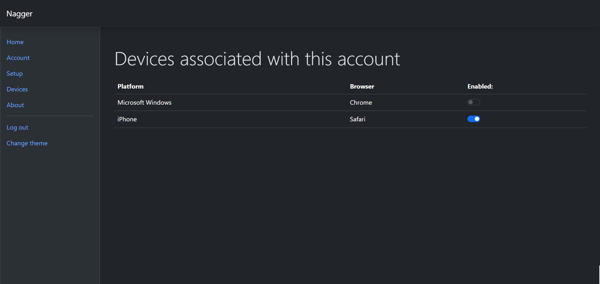

  

<h3>Nagger</h3>

 

  
Table of Contents

  <ol>
    <li>
      <a href="#about-the-project">About The Project</a>
      <ul>
        <li><a href="#built-with">Built With</a></li>
      </ul>
    </li>
    <li>
      <a href="#getting-started">Getting Started</a>
      <ul>
        <li><a href="#prerequisites">Prerequisites</a></li>
        <li><a href="#installation">Installation</a></li>
      </ul>
    </li>
    <li><a href="#usage">Usage</a></li>
    <li><a href="#roadmap">Roadmap</a></li>
    <li><a href="#contributing">Contributing</a></li>
    <li><a href="#license">License</a></li>
    <li><a href="#contact">Contact</a></li>
    <li><a href="#acknowledgments">Acknowledgments</a></li>
  </ol>

## About this Project
Nagger is a web-based application that is designed to be used to set short-term reminders for small and easily forgettable tasks that we face throughout the day, such as wishing happy birthday to a distant relative or an acquaintance. You can see a demo video below.

### Built with

* [![Bootstrap][Bootstrap.com]][Bootstrap-url]
* [![Javascript][js.com]][js-url]
* [![Nodejs][node.com]][node-url]
* [![Express][Express.com]][Express-url]
* [![MySQL][mysql.com]][mysql-url]

## Features
* <strong>Notifications</strong> - the main feature, web push notifications, send periodically on a user-customizable time interval, based on the Naggers that the user has set. Naggers can be edited after they have been already added.
* <strong>Accounts</strong> - the application has a variety of account features, which include:
  * Registration and login
  * Change of password from within the page
  * Password reset with email and URL token
* <strong>Devices</strong> - every device that logs in in a given account gets saved in the user's profile. This way a Nagger notification can be sent to all of the user's devices. Which device receives notifications is a subject to customization as well.
* <strong>Theme</strong> - the user can switch between light and dark theme.

## Security features
* <strong>HTTPS</strong> - the application works only with HTTPS, meaning that sensitive user data is protected enroute.
* <strong>Password hashing (10 rounds) with salt</strong> - ensuring that even if the database gets leaked, user passwords will not be stolen.
* <strong>reCAPTCHA v3</strong> for sensitive forms. This technology protects the server from spam and bot requests.
* Strict <strong>password reset</strong> logic featuring a 40-character long URL token with limited validity, ensuring that this commonly attacked place is well-protected.

## Usage
The front-end of this application is accessible from a browser under the specified domain (currently https://nagnag.me). After account creation (or login), the user must enable push notifications for the current browser from the 'Setup' tab. This action registeres the device (browser) in the list of user's devices eligible for receiving notifications from Naggers.
 
 

 
 

 
 
Once this setup is completed, the user can start adding Naggers from the Home page.
 
 

 
 

[Bootstrap.com]: https://img.shields.io/badge/Bootstrap-563D7C?style=for-the-badge&logo=bootstrap&logoColor=white
[Bootstrap-url]: https://getbootstrap.com
[Express.com]: https://img.shields.io/badge/Express.js-404D59?style=for-the-badge
[Express-url]: https://expressjs.com/
[AWS.com]: https://img.shields.io/badge/Amazon_AWS-232F3E?style=for-the-badge&logo=amazon-aws&logoColor=white
[AWS-url]: https://aws.amazon.com/
[mysql.com]: https://img.shields.io/badge/MySQL-00000F?style=for-the-badge&logo=mysql&logoColor=white
[mysql-url]: https://www.mysql.com/
[js.com]: https://img.shields.io/badge/JavaScript-F7DF1E?style=for-the-badge&logo=javascript&logoColor=black
[js-url]: https://www.w3schools.com/js/
[node.com]: https://img.shields.io/badge/Node.js-43853D?style=for-the-badge&logo=node.js&logoColor=white
[node-url]: https://nodejs.org/en
